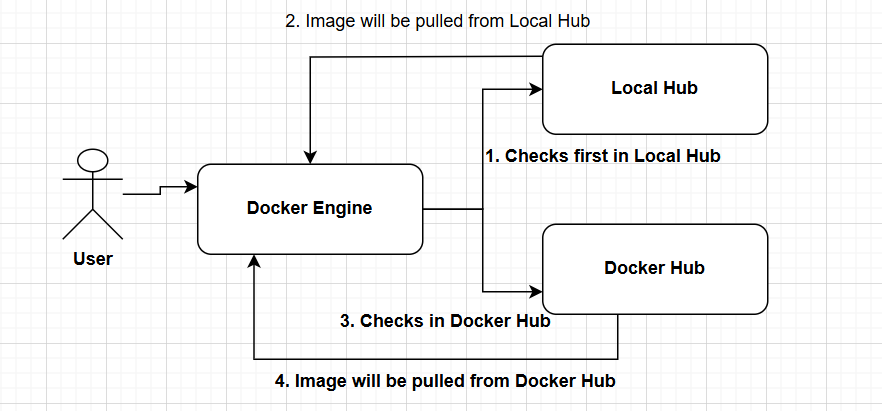
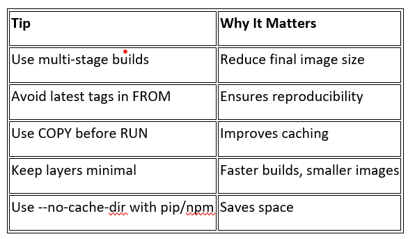
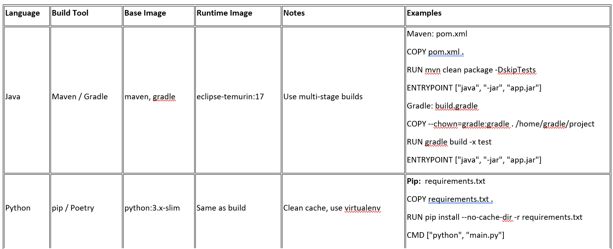
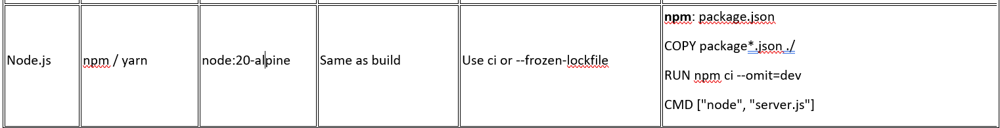
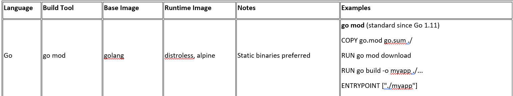
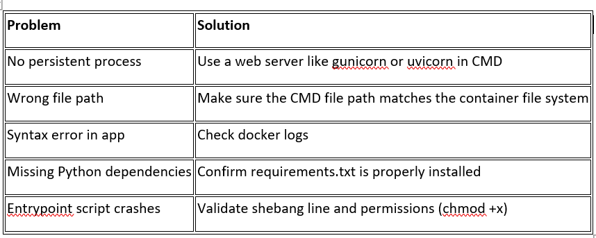
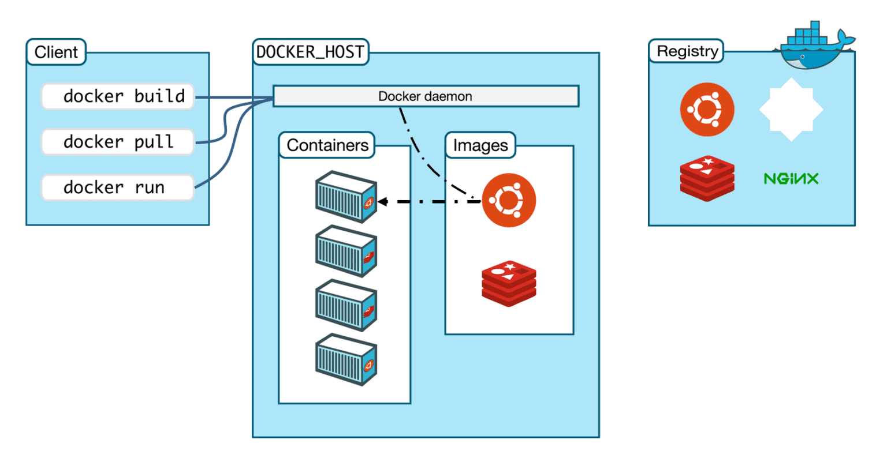
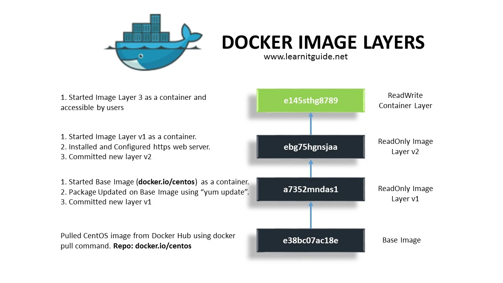

What is docker?
-------------------
 - Docker is an open-source platform that enables developers to build, package, and run applications in containers.

What is Docker Compose?
---------------------------
 - Docker Compose is a tool that lets you define and run multi-container Docker applications using a single YAML file (docker-compose.yml).

What is a Docker Volume?
--------------------------
A Docker volume is a persistent storage mechanism used by Docker containers. Volumes:
  - Store data outside the container’s writable layer
  - Persist even after the container is removed
  - Are managed by Docker (unlike bind mounts)

Purpose of Multi-Stage Builds in Docker?
-----------------------------------------------
Multi-stage builds in Docker help you create lean, secure, and efficient images by separating build-time and runtime environments.

Why Use Multi-Stage Builds?
-----------------------------
  1. Large image size due to build tools: Use one stage to build, and another to copy only the result
  2. Sensitive files or dependencies leak into final image: Don’t copy them to final stage
  3. Multiple tools/environments needed: Separate them into different stages
  4. Slow builds: Optimize with caching and smaller stages

Docker Image
------------------
- It's a light-weight,standalone and executable package that includes Code+Runtime+Libraries
  +Environment variables+configuration files
- Docker Images are immutable
- Docker Images are really portable

Docker Containers
---------------------------
- Running instances of images are called containers 
- Isolation
- Ephemeral
- Portable

How Docker Works
-------------------

Docker Commands
--------------------
- docker pull <image-id>
- docker run <image-id> (Pull+Create+Start) (-d-->detached mode)
- docker ps
- docker ps -a (or --all)
- docker stop <container-id>
- docker images
- docker rmi <Image-Id> (or <image-name>) (-f --> forcebly)
- docker rm <container-id>
- docker exec -it <container-id> /bin/bash (or --bash) (-it-->interactive mode)
- docker build -t dasaridevops/name:tag .
- docker run -p targetport:containerport dasaridevops/name:tag
- docker inspect <container_id_or_name>
- docker logs <container_id_or_name>
- docker login
- docker push <image-name>
- docker rm -f <containername> or <container-id> (-f--> forcibly)
- docker rmi <imagename> or <image-id>
- docker rm -f `docker ps -a -q`
- docker-compose up -d
- docker-compose down
- docker compose start
- docker compose stop
- docker compose ps
- docker compose logs
- docker network ls
- docker network create <name>
- docker network inspect <name>
- docker network rm <name>
- docker network connect <network> <container>
- docker network disconnect <network> <container>
- docker volume ls
- docker volume create <name>
- docker volume inspect <name>
- docker volume rm <name>
- docker volume prune

Docker Instructions
--------------------------
1. FROM: Sets the base image for the Docker image
   - All Dockerfiles must start with FROM.
   - Use lightweight base images like alpine or *-slim for smaller image sizes.
   - Multi-stage builds use multiple FROM statements.
2. LABEL: Adds metadata to the image.
   - Useful for documentation, versioning, and automation.
3. ENV: Sets environment variables.
   - Helps avoid repeating values.
   - PYTHONUNBUFFERED=1 ensures real-time output in logs.
   - Can be overridden at runtime using docker run -e.
4. WORKDIR: Sets the working directory for all subsequent instructions.
   - Automatically creates the directory if it doesn't exist.
   - Safer and more readable than using RUN cd.
5. COPY/ADD: Copies files/folders from the host to the image.
   - Relative to the Docker build context (. when running docker build).
   - Prefer specific COPY for better caching (COPY requirements.txt . before COPY . .).
6. RUN: Executes a command during image build.
   - Creates a layer in the image.
   - Use && to chain commands and reduce layers:
7. CMD: Specifies the default command to run when a container starts.
   - Only one CMD is allowed; the last one overrides earlier ones.
   - Use exec form (JSON array) for better signal handling.
8. ENTRYPOINT: Defines the main command to run, allowing arguments from CMD.
   - ENTRYPOINT is best for defining what the container is, and CMD is for its default args.
9. EXPOSE: Documents the port the container listens on.
   - It does not publish the port; it's for documentation.
   - Use -p 8000:8000 in docker run to expose it to the host.
10. USER: Sets the user that will run the container processes.
   - Avoid running as root for security reasons.
   - You can define a user with limited permissions.
11. HEALTHCHECK: Defines how Docker checks if the container is healthy.
   - Docker monitors the container and can restart it if unhealthy (with orchestrators like Docker Swarm or Kubernetes).
12. .dockerignore: Excludes files from being sent to the Docker daemon during build.
   - Reduces build time, image size, and security risk.

CMD vs ENTRYPOINT
-----------------------
CMD:
  - Sets default command/args
  - Can be overridden in docker run
ENTRYPOINT:
  - Sets fixed command
  - Runs even if docker run adds arguments
Best Approach: 
  ENTRYPOINT ["python"]
  CMD ["app.py"]

Best Practice: Use ENTRYPOINT for the executable, CMD for default arguments.

COPY vs ADD
---------------
COPY: Copies local files
ADD: Copy remote files (HTTP/S), Extract .tar.gz archives

Best Practice: Use COPY unless you specifically need ADD features.

RUN vs CMD
---------------
RUN: Runs at build time, 
CMD: Runs at runtime (when the container starts)

ARG vs ENV
---------------
  - ARG variables work only at build time But ENV variables can work both at build and runtimes
  - ARG COURSE
    ENV COURSE=${ COURSE }

ONBUILD
-----------
  - Develop docker images and publish, so someone will use that image. ONBUILD will not get executed at build time rather it is used when someone uses that image

Summary of Best Practices
------------------------------
  - Use WORKDIR instead of cd
  - Use COPY over ADD
  - Use exec form for CMD/ENTRYPOINT
  - Combine CMD + ENTRYPOINT for flexible defaults
  - Minimize layers by chaining RUN
  - Use ENV for config, LABEL for metadata
  - Never expose secrets in ENV or image

Dockerize Applications
-------------------------

Troubleshoot a Docker Container That Exits Immediately?
--------------------------------------------------------------------
When a Docker container exits immediately, it’s usually because:
  - The main process (PID 1) inside the container has terminated.
  - There was a misconfiguration, crash, or incorrect command in the Dockerfile or entrypoint.
1. Check the exit code - docker ps -a
  - Exit 0: The container completed successfully but had nothing to keep it alive.
  - Non-zero: An error or crash occurred.
2. Inspect the logs - docker logs <container_id_or_name>
Look for:
  - Python exceptions
  - Missing files or misconfigured entrypoints
  - Syntax errors
  - Missing environment variables
3. Run the container interactively - docker run -it --entrypoint /bin/sh <image_name>
This allows you to:
  - Inspect the filesystem
  - Check the Python environment
  - Manually run the start command
4. Check the CMD or ENTRYPOINT
Common issues:
  - No long-running process (e.g., Flask app isn’t started).
  - Syntax errors in CMD or ENTRYPOINT.
5. Check for required environment variables or files
If your app depends on:
  - .env files
  - Mounted volumes
  - Configuration values
  - Make sure they are present or injected properly.
6. Use docker inspect - docker inspect <container_id_or_name>
Look for:
  - Command used to start the container
  - Environment variables
  - Mounts and volumes
7. Add a sleep or tail command (for debugging only)
  CMD ["sleep", "3600"]
  CMD ["tail", "-f", "/dev/null"]

Common Causes
----------------------

>
 Docker Best Practices
 ---------------------------
 - Keep the image size low
 - Use official images
 - Use multi-stage builds
 - Don't run containers with root access
 - Keep the environment from code
 - Persist the logs
 - Maintain own network instead of default
 - Create Docker volumes
 - Optimize layers

 Docker Architecture
 ----------------------
 

 Docker Container Lifecycle Management
 ---------------------------------------
  - Create, run, pause, stop and delete
  
 Docker Layers
 -----------------
 - Once docker image is created we cannot modify the image because docker images are immutable
 - Docker follows layering approach

 - FROM almalinux:8
 1st Instruction - It pulls the image and creates container out of this image. Then layer1 is created.
 Inside layer1 container, docker is running 2nd instruction.
 - RUN yum install nginx -y
 Now layer2 image is created
 layer2 container is created by docker engine
 In Layer2 container, layer3 instruction will run
 Now layer 3 image is created and that is final
 RUN echo "Hello">/opt/hello.html
 - These layers will be cached
 - If the instructions are more, build time is more and when docker push layers will be pushed to the container registry and memory is high

 

 How to optimize layers
 --------------------------
 - Club multiple instructions as single instruction
   Example: RUN yum install nginx -y && RUN echo "Hello">/opt/hello.html
 - Keep the frequently changing instructions at end so that previous layers will not get affected   
   and your build process is fast

Disadvantages of Docker
------------------------
 - What happens if docker server is crashed
    Application goes down
    You loose data also, docker volumes are inside the server
 - What happens if you suddenly get more traffic
    We have to run multiple containers
 - How to balance the lod if you have multiple cart containers
 - No self healing
 - No auto-scaling
 - What about configs and secrets